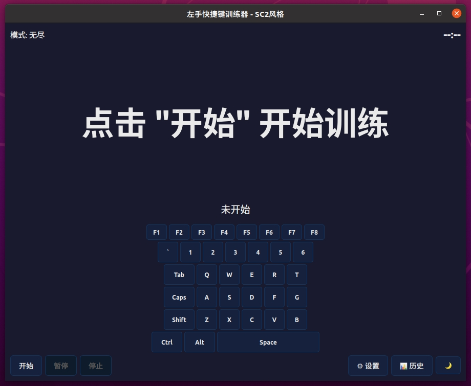

# 左手快捷键训练器 (Left Hand Keyboard Trainer)

专为星际争霸2 (SC2) 玩家设计的左手快捷键练习软件，帮助你提升左手操作的肌肉记忆和反应速度。



## ✨ 功能特点

### 🎮 多种训练类型
- **单键练习**: 练习基础的单个按键 (1-5, Q-T, A-G, Z-B)
- **特殊键练习**: Space, Tab, CapsLock, F1-F8
- **组合键练习**: 
  - Ctrl+1~9 (控制编队)
  - Shift+1~5 (添加到编队)
  - Ctrl+Q/W/E/R/A/S/D/F/Z/X/C/V
  - Shift+Q/W/E/R/A/S
  - Alt+F1~F4
- **序列练习**: 模拟实战中的连续按键操作
  - 简单序列: 1a, 2a, 3a, 1s, 2s...
  - 复杂序列: qwer, asdf, zxcv, wasd, 1a2a3a...

### 🎯 难度级别
- **入门**: 仅练习基础单键和空格
- **进阶**: 添加特殊键和常用组合键
- **高级**: 所有按键和序列训练
- **自定义**: 选择你想练习的类型组合

### ⏱️ 训练模式
- **无尽模式**: 没有时间限制，随时开始和停止
- **计时模式**: 设定固定时间，看能完成多少轮
- **挑战模式**: 设定目标轮数，计算完成时间
- **禅模式**: 无统计，纯粹练习，专注当下

### 📊 统计与历史
- 实时显示正确率和速度 (轮/分钟)
- 保存训练历史记录 (最近100次)
- 显示最佳成绩统计

### 🎨 其他功能
- **虚拟键盘**: 实时高亮显示目标按键
- **暗/亮主题**: 保护眼睛，适应不同环境
- **暂停/继续**: 支持中途暂停训练
- **设置持久化**: 自动保存你的偏好设置

## 🛠️ 编译构建

### 依赖
- Qt 6 (Widgets模块)
- CMake 3.16+
- C++17 兼容的编译器

### 构建步骤

```bash
# 创建构建目录
mkdir build && cd build

# 配置 (使用系统Qt)
cmake ..

# 或者指定Qt路径
cmake .. -DCMAKE_PREFIX_PATH=/path/to/Qt/6.x.x/gcc_64

# 编译
make -j$(nproc)

# 运行
./LeftHandTrainer
```

## 🎮 使用方法

### 基本操作
1. 点击 **开始** 按钮开始训练
2. 按照屏幕中央显示的提示按下对应按键
3. 正确后自动切换到下一个
4. 按 **ESC** 或点击 **停止** 结束训练

### 快捷键
- `ESC`: 停止训练
- `空格`: 暂停时恢复训练

### 设置说明
1. 点击 **⚙ 设置** 进入设置页面
2. 选择难度级别和训练模式
3. 调整计时/挑战模式的参数
4. 开启/关闭虚拟键盘显示
5. 点击 **← 返回训练** 保存并返回

### 查看历史
1. 点击 **📊 历史** 查看训练记录
2. 查看总体统计和最佳成绩
3. 浏览最近的训练详情

## 🎯 训练建议

### 新手入门
1. 从 **入门难度** 开始
2. 使用 **无尽模式** 熟悉按键位置
3. 观察虚拟键盘辅助定位

### 进阶提升
1. 切换到 **进阶难度**
2. 使用 **计时模式** (60秒) 测试速度
3. 目标: 正确率 > 95%, 速度 > 60轮/分钟

### 高手挑战
1. 使用 **高级难度**
2. 尝试 **挑战模式** (100轮)
3. 关闭虚拟键盘，完全依靠肌肉记忆

### SC2 实战技巧
- 控制编队: Ctrl+数字键 创建，数字键 选择
- 添加单位: Shift+数字键 添加到编队
- 1a, 2a, 3a 是常用的编队A键移动操作
- 练习 qwer/asdf/zxcv 行的连续按键

## 📁 项目结构

```
practice_left/
├── CMakeLists.txt        # CMake 构建配置
├── main.cpp              # 程序入口
├── trainer_window.h      # 训练窗口头文件
├── trainer_window.cpp    # 训练窗口实现
├── README.md             # 本文档
└── LICENSE               # 许可证
```

## 📝 版本历史

### v2.0.0 (当前版本)
- 新增难度级别系统
- 新增多种训练模式 (计时/挑战/禅)
- 新增虚拟键盘显示
- 新增训练历史记录
- 新增暂停/继续功能
- 新增设置持久化
- 改进UI设计和主题
- 大幅扩展训练内容

### v1.0.0
- 基础训练功能
- 单键/组合键/序列练习
- 明暗主题切换

## 🤝 贡献

欢迎提交 Issue 和 Pull Request!

## 📄 许可证

本项目采用 MIT 许可证。详见 [LICENSE](LICENSE) 文件。

---

**GLHF! 祝你在天梯上越战越勇! 🎮**
